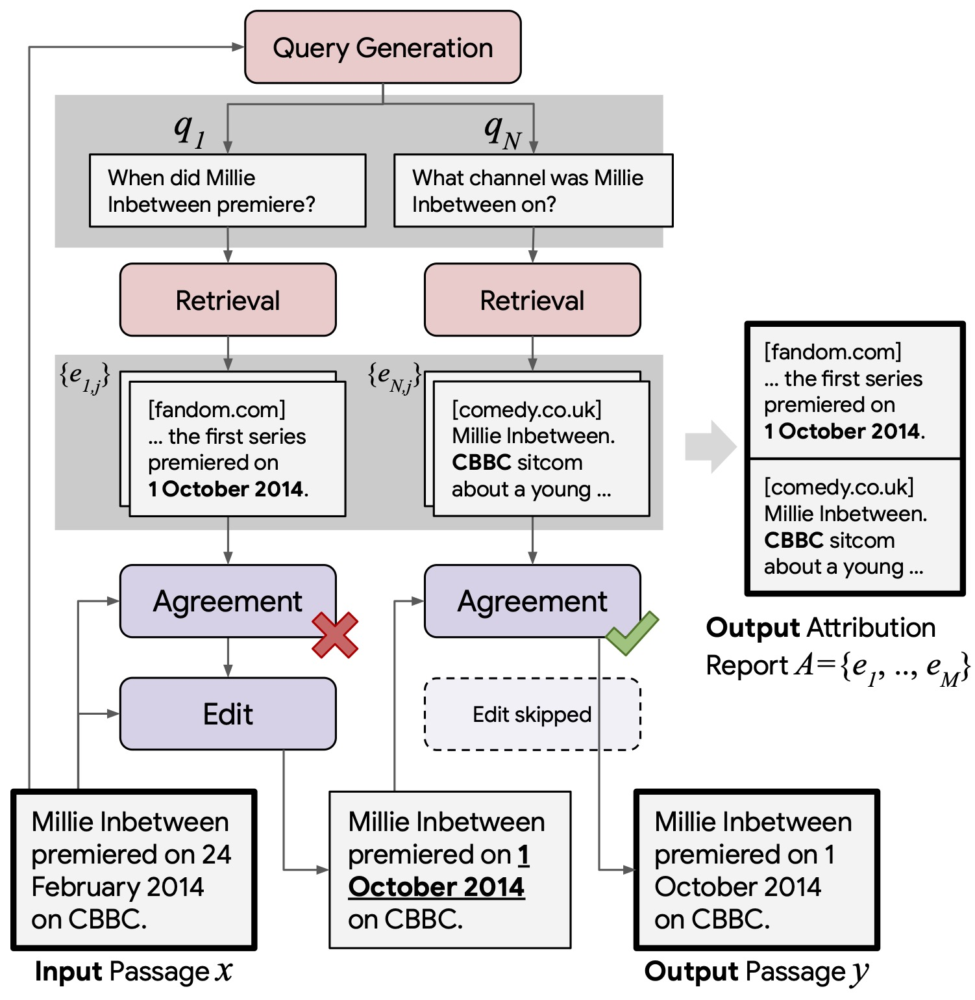

# RARR: Researching and Revising What Language Models Say, Using Language Models

Welcome! This repository contains a public implementation for [RARR: Researching and Revising What Language Models Say, Using Language Models](https://arxiv.org/abs/2210.08726) from CMU, Google Research, and UC Irvine. RARR addresses the attribution and factuality problems in large language models (LLMs) in a post-hoc manner by retrieving evidence to attribute the LLM's output and editing the output to be facutally consistent with the evidence.
RARR uses large language models themselves to do the editing.

The techniques in RARR are quite general so if you are working on ***any*** task using LLMs to edit the output of LLMs (*e.g.*, removing bias, fixing toxing outputs, etc.), you may find this repository a good starting point.

## Getting Started

### Environment Setup
The repository was tested on Ubuntu 20.04.2 LTS with CUDA 11.1.

We recommend using [Poetry](https://python-poetry.org/docs/) to install dependencies.
After installing Poetry, if you also have CUDA 11.1, simply run `poetry install` to install dependencies.
If you do not have CUDA 11.1, delete the `poetry.lock` file, then run `poetry install`.
Run `poetry shell` to launch the environment.

Alternatively, you can use `requirements.txt` which is derived from the `poetry.lock` file however you may have to change the `nvidia-*` versions in the file if you are not using CUDA 11.1.

Finally run `python -m spacy download en_core_web_sm`.

### Setting up APIs
#### **Bing API**
We use Bing to search for relevant evidence.
To setup a Bing API, create an [Azure account](https://portal.azure.com/#home), then [create a subscription](https://portal.azure.com/#view/Microsoft_Azure_Billing/SubscriptionsBlade), then [create a Bing Search API](https://portal.azure.com/#create/microsoft.bingsearch) using the subscription you created.
We recommend the [S2 pricing plan](https://www.microsoft.com/en-us/bing/apis/pricing) which costs $3 every 1000 calls.
You will be given two API keys.
Copy one of the keys and add the following to your `~/.bash_profile`:
```bash
export AZURE_SEARCH_KEY="<BING_API_KEY>"
```

#### **OpenAI API**
We use LLMs from OpenAI to verify and edit the claims.
Add the following to your `~/.bash_profile`:
```bash
export OPENAI_API_KEY="<OPENAI_API_KEY>"
```

## Using RARR to Improve Attribution and Factuality of LLMs
<!--  -->
<p align="center"></p>
<!-- <p align="center">An overview of RARR, which improves attribution via research and revision.</p> -->

RARR (***R**etrofit **A**ttribution using **R**esearch and **R**evision*), improves the attribution and factuality of langauge models by taking their outputs and applying a post-hoc retrieve-and-edit approach.
Given the output of a LLM (*i.e.*, claim), RARR applies the following steps:

1. [Question Generation](utils/question_generation.py): We generate a set of queries using a prompted LLM to interrogate the claim.
2. [Search](utils/search.py): For each query, we search for relevant webpages, then apply a passage extractor to retrieve the most relevant passage(s) for the query as evidence.
3. We iteratively use each evidence to edit the claim in two steps.
    1. [Agreement Gate](utils/agreement_gate.py): We use a prompted LLM to decide whether the current evidence contradicts the information in the claim. If so, we move to editing. If not, we skip editing.
    2. [Editing](utils/editor.py): We use a prompted LLM to edit the claim so it is consistent with the current evidence.
4. [Generating Attribution Report](utils/evidence_selection.py): We extract a subset of the evidence as an attribution report (*i.e.*, a citation for information in the claim).

### Editing a File of Claims
Given a JSONLines file, where each line is a dictionary with the key `input_info` and under this is a dictionary with a claim field run the following.
An example line:
`{"input_info": {"claim": "Michael Jordan played for the LA Lakers."}}`

```bash
python run_editor_sequential.py \
  --input_file "path/to/input_file.jsonl" \
  --output_file "path/to/output_file.jsonl" \
  --model_name "text-davinci-003" \
  --claim_field "claim"
```

### Editing a Single Claim
```python
import json
from run_editor_sequential import run_editor_one_instance

claim = "Michael Jordan played for the LA Lakers."
result = run_editor_one_instance(claim=claim, model="text-davinci-003")
print(json.dumps(result, indent=4))
```

### Launcing an Interactive Demo of RARR
```bash
streamlit run launch_editor_demo.py --server.baseUrlPath rarr --server.fileWatcherType none
```

## Citation
If you find this repository useful, please cite the RARR paper.
```
@article{Gao2022RARRRA,
  title={RARR: Researching and Revising What Language Models Say, Using Language Models},
  author={Luyu Gao and Zhuyun Dai and Panupong Pasupat and Anthony Chen and Arun Tejasvi Chaganty and Yicheng Fan and Vincent Zhao and N. Lao and Hongrae Lee and Da-Cheng Juan and Kelvin Guu},
  journal={ArXiv},
  year={2022},
  volume={abs/2210.08726},
  url={https://arxiv.org/abs/2210.08726},
}
```